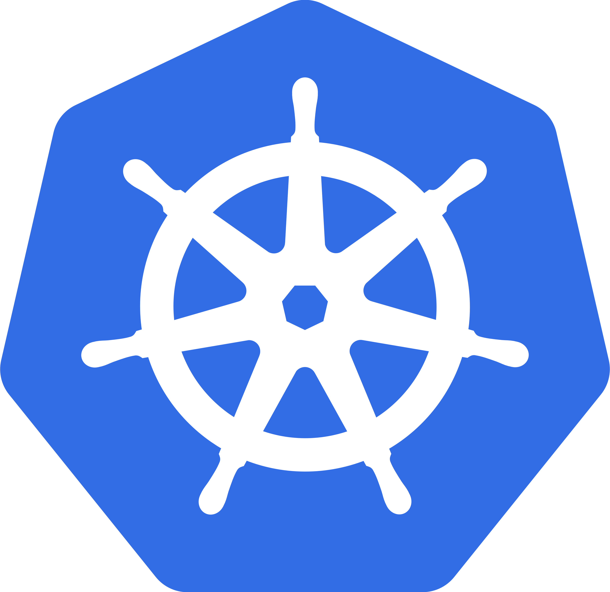

# Quickstart

This section details several ways to start using and working with Quorum, ranging from using our wizard to generate a local network, to configuring and creating a full network from scratch.

## Quickstart with Quorum Wizard

The easiest way to get a network up and running is by using [Quorum Wizard](../../Wizard/GettingStarted).  This command-line tool provides the means to create a local Quorum network that can be started and be ready for use in minutes. It provides options for configuring the network and then generates all the resources to run either in containers using docker-compose, or locally through the use of bash scripts. (Requires [NodeJS](https://nodejs.org/), Linux/Mac only)

```
npm install -g quorum-wizard
quorum-wizard
```

To explore the features of Quorum and deploy a private contract, follow the instructions on [Interacting with the Network](../../Wizard/Interacting)

## Quorum Examples' sample network

[Quorum Examples](../Quorum-Examples) provides the means to quickly create a pre-configured sample Quorum network that can be run either in a virtual-machine environment using Vagrant, in containers using docker-compose, or locally through the use of bash scripts to automate creation of the network.

## {: style="height:20px;width:20px"} Quorum on Kubernetes

Use [qubernetes](https://github.com/jpmorganchase/qubernetes) to run configurable N node Quorum networks on Kubernetes.  
   
You can use [kind](https://github.com/jpmorganchase/qubernetes#quickest-start) or [Minikube](https://github.com/jpmorganchase/qubernetes/blob/master/docs/minikube-docs.md) 
for local development.  For long running networks, use a cloud service (e.g. Google Kubernetes Engine, Azure KS, AWS EKS) or a self-hosted kubernetes cluster.

Supports Raft and Istanbul consensus algorithms, multiple Quorum and Transaction Manager (Tessera and Constellation) versions, 
and networks with an arbitrary number of nodes.
Also includes [examples](https://github.com/jpmorganchase/qubernetes/blob/master/docs/7nodes-on-k8s.md) ready to run on Kubernetes. 

## Creating a network from scratch

[Creating a Network From Scratch](../Creating-A-Network-From-Scratch) provides a step-by-step walkthrough of how to create and configure a Quorum network suitable for either Raft or Istanbul consensus.  It also shows how to enable privacy and add/remove nodes as required.

## Creating a network deployed in the cloud

[Quorum Cloud](https://github.com/jpmorganchase/quorum-cloud) provides an example of how a Quorum network can be run on a cloud platform.  It uses Terraform to create a 7 node Quorum network deployed on AWS using AWS ECS Fargate, S3 and an EC2.
